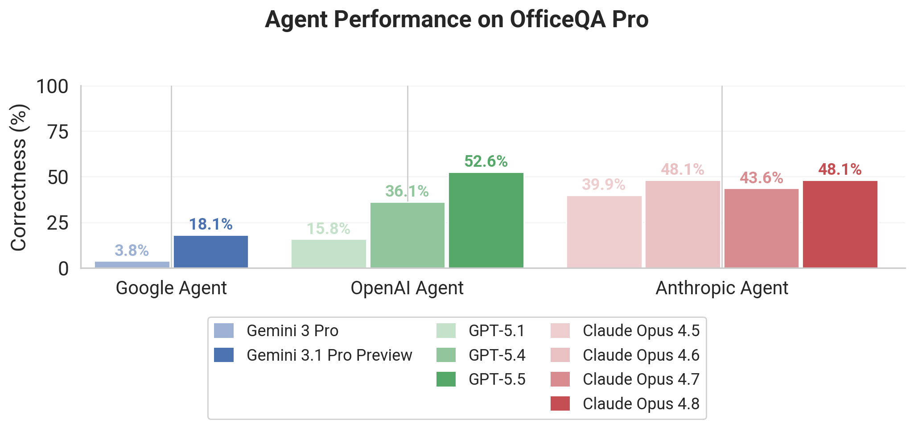
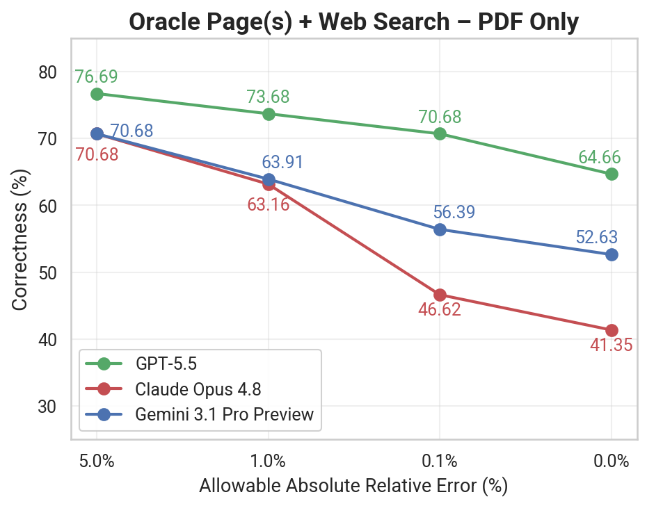

# OfficeQA

A Grounded Reasoning Benchmark by Databricks

<p align="center"></p>

**OfficeQA** is a benchmark by Databricks, built for evaluating model / agent performance on end to end **Grounded Reasoning** tasks. The benchmark is split into two subsets:

1. **OfficeQA Pro**: The default for evaluating frontier models (N=133)
2. **OfficeQA Full**: A version of the benchmark containing additional easier questions to hillclimb systems on (N=246)

Additional details:

- Questions require the **[U.S Treasury Bulletin](https://fraser.stlouisfed.org/title/treasury-bulletin-407?browse=1930s)** documents to answer
- Datasets released under **CC-BY-SA 4.0** and code and scripts under **Apache 2.0 License**.
- For more information, see the **[OfficeQA Technical Report](https://arxiv.org/abs/2603.08655)**

### Data Access

As of May 2026, all large files (benchmark CSVs, Treasury Bulletin PDFs, and parsed docs) have been moved from this GitHub repo to [Hugging Face](https://huggingface.co/datasets/databricks/officeqa). The CSVs are gated to ensure agents browsing the web do not have access— request access on Hugging Face to get the benchmark questions and answers.

Once you've requested and been granted access, you can load the benchmark data:
```python
from datasets import load_dataset
# Authenticate first: huggingface_hub.login() or set HF_TOKEN env var
dataset = load_dataset("databricks/officeqa", data_files="officeqa_pro.csv", split="train")
```

## Overview

OfficeQA evaluates how well AI systems can reason over real-world documents to answer complex questions. The benchmark uses historical U.S. Treasury Bulletin PDFs (1939-2025), which contain dense financial tables, charts, and text data.

**Repository Contents:**

| File/Dir | Description |
|---|---|
| `reward.py` | Evaluation script for scoring model outputs |
| `corpus_scripts/` | Scripts and notebooks for working with the Treasury Bulletin corpus |

**All benchmark data (CSVs, PDFs, parsed docs) is on [Hugging Face](https://huggingface.co/datasets/databricks/officeqa).**

**Dataset Schema (**`officeqa_pro.csv` **/** `officeqa_full.csv`**):**


| Column         | Description                                                              |
| -------------- | ------------------------------------------------------------------------ |
| `uid`          | Unique question identifier                                               |
| `question`     | The question to answer                                                   |
| `answer`       | Ground truth answer                                                      |
| `source_docs`  | Original URL(s) from the Federal Reserve Archive                         |
| `source_files` | Corresponding parsed filename(s) (e.g., `treasury_bulletin_1941_01.txt`) |
| `difficulty`   | `easy` or `hard`                                                         |


## Results

Headline results on **OfficeQA Pro** (N=133). See the [OfficeQA Technical Report](https://arxiv.org/abs/2603.08655) for the full evaluation methodology and additional settings.

### Agent Harness Performance

End-to-end performance of frontier agents operating over the Treasury Bulletin corpus.

<p align="center">
  
</p>

GPT-5.1 and Opus 4.5 Results included as reference point to results from the [OfficeQA blog](https://www.databricks.com/blog/introducing-officeqa-benchmark-end-to-end-grounded-reasoning) and re-run with latest OfficeQA Pro. Recorded on March 9 2026 [OfficeQA Technical Report](https://arxiv.org/abs/2603.08655).

GPT-5.4 and Opus 4.6 Results recorded on March 9 2026 [OfficeQA Technical Report](https://arxiv.org/abs/2603.08655).
Opus 4.7 Results recorded on April 21 2026.


### LLM with Oracle Page(s) + Web Search (PDF Only)

LLM performance when provided the oracle page(s) needed to answer each question along with web search access, evaluated across varying absolute relative error tolerances.

<p align="center">
  
</p>

GPT-5.4 and Opus 4.6 Results recorded on March 9 2026 [OfficeQA Technical Report](https://arxiv.org/abs/2603.08655).
Opus 4.7 Results recorded on April 21 2026.

## Getting Started

### 1. Load the benchmark questions (from Hugging Face)

```python
from datasets import load_dataset
# Authenticate first (dataset is gated)
# huggingface_hub.login() or set HF_TOKEN env var

# Pro subset — default for evaluating frontier models
dataset = load_dataset("databricks/officeqa", data_files="officeqa_pro.csv", split="train")

# Full benchmark — includes easier questions for hillclimbing
dataset = load_dataset("databricks/officeqa", data_files="officeqa_full.csv", split="train")
```

### 2. Clone the code repository (for reward.py and scripts)

```bash
git clone https://github.com/databricks/officeqa.git
cd officeqa
```

### 3. Download the corpus (from Hugging Face)

We recommend using parsed txt files found here:

```python
from huggingface_hub import snapshot_download

# Download transformed text (recommended for LLM/RAG workflows, ~460MB)
local_dir = snapshot_download(
    repo_id="databricks/officeqa",
    repo_type="dataset",
    allow_patterns="treasury_bulletins_parsed/transformed/*.txt",
)
```

If you'd like to use the raw json parse or original PDFs, you can also download them here:

```
# Download parsed JSON docs (~730MB, with bounding boxes, tables, metadata)
local_dir = snapshot_download(
    repo_id="databricks/officeqa",
    repo_type="dataset",
    allow_patterns="treasury_bulletins_parsed/jsons/*.json",
)

# Download original PDFs (~4GB)
local_dir = snapshot_download(
    repo_id="databricks/officeqa",
    repo_type="dataset",
    allow_patterns="treasury_bulletin_pdfs/*",
)
```

| Format          | Best for                                                           | Size   |
| --------------- | ------------------------------------------------------------------ | ------ |
| PDFs            | Systems with native PDF support, or you want to parse from scratch | ~4GB   |
| Parsed JSON     | Full structural information, coordinates                           | ~730MB |
| Transformed TXT | LLM/agent consumption, cleaner text                                | ~460MB |

See [`corpus_scripts/`](corpus_scripts/) for scripts to create alternative text representations from the parsed JSONs, and to visualize the parsed bounding boxes on top of the PDFs.

### 4. Evaluate your model outputs

```python
from reward import score_answer

# Score a single prediction
score = score_answer(
    ground_truth="123.45",
    predicted="123.45",
    tolerance=0.01  # 1% tolerance for numerical answers
)
print(f"Score: {score}")  # 1.0 for correct, 0.0 for incorrect
```

The `reward.py` script provides fuzzy matching for numerical answers with configurable tolerance levels:

- `0.0%` - Exact match
- `0.1%` - Within 0.1% relative error
- `1.0%` - Within 1% relative error
- `5.0%` - Within 5% relative error
etc.


## Mapping source URLs to parsed files

The `source_files` column in the dataset CSVs provides the direct filenames (e.g., `treasury_bulletin_1941_01.txt`) for easy reference. Here's how the URL-to-filename conversion works:

**URL format:** `https://fraser.stlouisfed.org/title/treasury-bulletin-407/{MONTH}-{YEAR}-{ID}?page={PAGE}`

**Filename format:** `treasury_bulletin_{YEAR}_{MONTH_NUM}.{ext}`

**Month name to number mapping:**

```
january   → 01    july      → 07
february  → 02    august    → 08
march     → 03    september → 09
april     → 04    october   → 10
may       → 05    november  → 11
june      → 06    december  → 12
```

**Example:**

- URL: `https://fraser.stlouisfed.org/title/treasury-bulletin-407/january-1941-6529`
- JSON file: `treasury_bulletins_parsed/jsons/treasury_bulletin_1941_01.json`
- Text file: `treasury_bulletins_parsed/transformed/treasury_bulletin_1941_01.txt`
- PDF file: `treasury_bulletin_pdfs/treasury_bulletin_1941_01.pdf`
